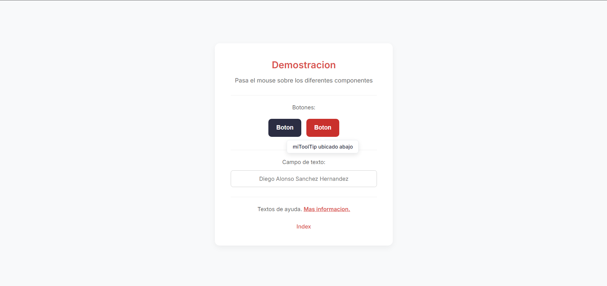
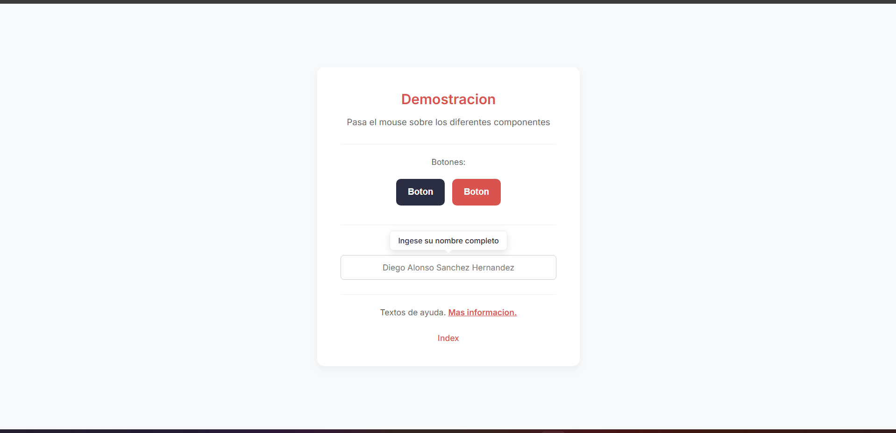

# Actividad 3. Componente Visual con JS: miToolTip

**Materia:** Programación Web  
**Estudiante:** Diego Alonso Sánchez Hernández  
**Profesora:** Adelina Martínez Nieto  
**Guthub Pages:** https://diegooash.github.io/Actividad3-miToolTip/
**Video demostracion:** https://drive.google.com/file/d/1MNUjBksk8YRLP9VVRFOGl44WO3szonLw/view?usp=sharing

---

## 1. Nombre del componente y problema que Resuelve

### **Nombre del Componente:** `miToolTip`

### **¿Qué problema resuelve?**
En el desarrollo de interfaces web, frecuentemente es necesario explicarle al usuario la función de un botón, indicar el formato esperado dentro de un campo de formulario o brindar definiciones de texto sin saturar la pantalla ni interrumpir el flujo de lectura. 

**`miToolTip`** resuelve este problema proporcionando globos de ayuda flotantes, elegantes y con animaciones suaves. Al ser un componente verdaderamente modular, se puede reutilizar sobre **cualquier etiqueta HTML** (botones, inputs, textos en línea, enlaces o imágenes) con una sola llamada a su función principal.


## 2. Instalación y configuración

Para integrar **miToolTip** en cualquier proyecto HTML, solo necesitas vincular las hojas de estilo y los scripts correspondientes:

### Paso 1: Incluir los estilos CSS
En el `<head>` de tu documento HTML, importa el archivo CSS general de tu interfaz y el archivo exclusivo del componente (`componente.css`), el cual controla la caja flotante, las sombras y las flechas directrices:

```html
<head>
    <meta charset="UTF-8">
    <meta name="viewport" content="width=device-width, initial-scale=1.0">
    <title>Mi Proyecto</title>
    <!-- Estilos de la interfaz -->
    <link rel="stylesheet" href="css/styles.css">
    <!-- Estilos exclusivos del componente miToolTip -->
    <link rel="stylesheet" href="css/componente.css">
</head>

```

### Paso 2: Importar los scripts de JavaScript

Justo antes de cerrar la etiqueta `</body>`, enlaza primero el motor lógico de la librería (`componente.js`) y después el archivo donde vas a inicializar tus tooltips (`demostracion.js`):

```html
    <!-- 1. Motor lógico del componente (debe cargarse primero) -->
    <script src="js/componente.js"></script>
    <!-- 2. Script de inicialización de los elementos de tu página -->
    <script src="js/demostracion.js"></script>
</body>
</html>

```

---

## 3. Uso y ejemplos de código.

La arquitectura de `miToolTip` permite una **reutilización total**. No requiere escribir estructuras HTML complejas adicionales ni modificar el código base del componente para cambiar los textos o ubicaciones.

### Sintaxis Principal:

```javascript
crearTooltip(selector_css, texto_mensaje, posicion);
```

* **`selector_css`**: El ID (`#id`) o la clase (`.clase`) del elemento que activará el globo al pasar el mouse.
* **`texto_mensaje`**: La cadena de texto que se mostrará dentro del tooltip.
* **`posicion`**: Parámetro opcional que define la orientación del globo. Acepta `"top"` (arriba) o `"bottom"` (abajo). Su valor por defecto es `"top"`.

---

### Ejemplo 1: Aplicación en botones

Permite dar contexto sobre lo que ocurrirá al presionar un botón:

```javascript
// Agrega un tooltip en la parte superior del botón 1
crearTooltip("#btn1", "miToolTip ubicado arriba", "top");

// Agrega un tooltip en la parte inferior del botón 2
crearTooltip("#btn2", "miToolTip ubicado abajo", "bottom");

```

---

### Ejemplo 2: Aplicación en campos de texto (`<input>`)

Es ideal para mostrar instrucciones de llenado, ejemplos de formato o reglas de validación sin amontonar texto en el formulario:

```javascript
// Muestra una guía de ayuda al pasar el cursor sobre el input
crearTooltip("#campoTexto", "Ingese su nombre completo", "top");

```

---

### Ejemplo 3: Aplicación en textos o enlaces (`<span>`)

Sirve para crear glosarios, notas aclaratorias o brindar más detalles sobre términos específicos dentro de un párrafo:

```javascript
// Despliega información adicional en una palabra o frase en línea
crearTooltip("#textoAyuda", "Da click para mas informacion", "bottom");

```

---

## 4. Capturas de pantalla y demostración

A continuación se muestra el componente funcionando en vivo dentro del navegador en elementos de formulario y textos en línea:

### Funcionamiento en botones 


*Figura 1: Funcionamiento de miToolTip en botones.*

### Funcionamiento en formulario


*Figura 2: Funcionamiento de miToolTip en campos de formularios.*

---
